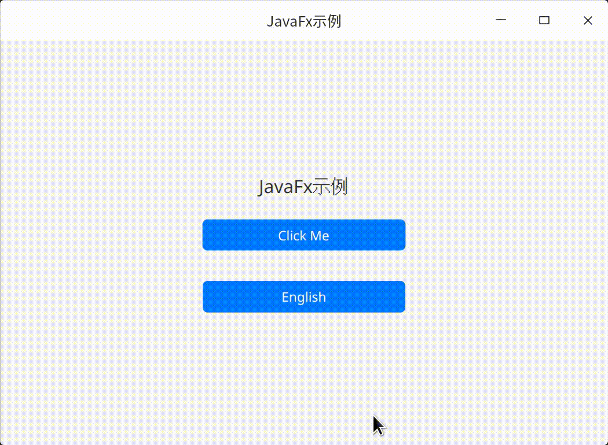

# JavaFxSample

JavaFx示例项目

演示使用[nesp-gradle-plugin-javafx](https://github.com/nespjin/nesp-gradle-plugin-javafx) 和
[nesp-sdk-javafx](https://github.com/nespjin/nesp-sdk-javafx)
开发JavaFx应用



### ViewBinding
```java
package com.nesp.javafx.sample;

import com.nesp.sdk.java.lang.SingletonFactory;
import com.nesp.sdk.javafx.BaseStage;
import javafx.beans.property.IntegerProperty;
import javafx.beans.property.SimpleIntegerProperty;
import javafx.beans.property.SimpleStringProperty;
import javafx.beans.property.StringProperty;
import javafx.event.EventHandler;
import javafx.scene.input.MouseEvent;
import javafx.stage.Stage;
import org.jetbrains.annotations.NotNull;

import java.util.Locale;
import java.util.Objects;

public class MainStage extends BaseStage {

    private static final String TAG = "MainStage";

    private MainStage() {
        //no instance
    }

    private MainStageViewBinding mBinding;

    private static boolean isShown = false;

    public static void showWindow() {
        if (isShown) return;
        var shared =
                SingletonFactory.getWeakInstance(MainStage.class, MainStage::new);
        shared.show();
        isShown = true;
    }

    @Override
    public void onCreate(final @NotNull Stage stage) {
        super.onCreate(stage);
        initializeViews();
    }

    private void initializeViews() {
        mBinding = MainStageViewBinding.inflate(R.layout.main_stage);
        setContent(mBinding.getRoot());
        final String title = getResource().getString(R.string.app_name);
        setTitle(title);

        StringProperty buttonText = new SimpleStringProperty("Click Me");

        IntegerProperty clickCount = new SimpleIntegerProperty() {
            @Override
            protected void invalidated() {
                super.invalidated();
                buttonText.setValue("Clicked " + get());
            }
        };

        mBinding.btn_click.setOnMouseClicked(event -> clickCount.set(clickCount.get() + 1));
        mBinding.btn_click.textProperty().bind(buttonText);

        mBinding.btn_switch_lang.setOnMouseClicked(new EventHandler<MouseEvent>() {
            @Override
            public void handle(final MouseEvent event) {
                if (Objects.equals(Locale.getDefault().getLanguage(), "zh")) {
                    Locale.setDefault(Locale.ENGLISH);
                    mBinding.btn_switch_lang.setText("中文");
                } else {
                    Locale.setDefault(Locale.SIMPLIFIED_CHINESE);
                    mBinding.btn_switch_lang.setText("English");
                }

                recreate();
            }
        });

        if (!Objects.equals(Locale.getDefault().getLanguage(), "zh")) {
            mBinding.btn_switch_lang.setText("中文");
        } else {
            mBinding.btn_switch_lang.setText("English");
        }
    }


}

```

## JavaFx App单例模式

```java
import javafx.application.*;
import javafx.geometry.Insets;
import javafx.scene.Scene;
import javafx.scene.control.*;
import javafx.scene.layout.*;
import javafx.stage.Stage;
import java.io.*;
import java.net.InetAddress;
import java.net.ServerSocket;
import java.net.Socket;
import java.util.UUID;
import java.util.concurrent.CountDownLatch;
public class SingleInstanceApp extends Application {
    private static final int SINGLE_INSTANCE_LISTENER_PORT = 9999;
    private static final String SINGLE_INSTANCE_FOCUS_MESSAGE = "focus";
    private static final String instanceId = UUID.randomUUID().toString();
    // We define a pause before focusing on an existing instance
    // because sometimes the command line or window launching the instance
    // might take focus back after the second instance execution complete
    // so we introduce a slight delay before focusing on the original window
    // so that the original window can retain focus.
    private static final int FOCUS_REQUEST_PAUSE_MILLIS = 500;
    private Stage stage;
    public void init() {
        CountDownLatch instanceCheckLatch = new CountDownLatch(1);
        Thread instanceListener = new Thread(() -> {
            try (ServerSocket serverSocket = new ServerSocket(SINGLE_INSTANCE_LISTENER_PORT, 10)) {
                instanceCheckLatch.countDown();
                while (true) {
                    try (
                            Socket clientSocket = serverSocket.accept();
                            BufferedReader in = new BufferedReader(
                                    new InputStreamReader(clientSocket.getInputStream()))
                    ) {
                        String input = in.readLine();
                        System.out.println("Received single instance listener message: " + input);
                        if (input.startsWith(SINGLE_INSTANCE_FOCUS_MESSAGE) && stage != null) {
                            Thread.sleep(FOCUS_REQUEST_PAUSE_MILLIS);
                            Platform.runLater(() -> {
                                System.out.println("To front " + instanceId);
                                stage.setIconified(false);
                                stage.show();
                                stage.toFront();
                            });
                        }
                    } catch (IOException e) {
                        System.out.println("Single instance listener unable to process focus message from client");
                        e.printStackTrace();
                    }
                }
            } catch(java.net.BindException b) {
                System.out.println("SingleInstanceApp already running");
                try (
                        Socket clientSocket = new Socket(InetAddress.getLocalHost(), SINGLE_INSTANCE_LISTENER_PORT);
                        PrintWriter out = new PrintWriter(new OutputStreamWriter(clientSocket.getOutputStream()))
                ) {
                    System.out.println("Requesting existing app to focus");
                    out.println(SINGLE_INSTANCE_FOCUS_MESSAGE + " requested by " + instanceId);
                } catch (IOException e) {
                    e.printStackTrace();
                }
                System.out.println("Aborting execution for instance " + instanceId);
                Platform.exit();
            } catch(Exception e) {
                System.out.println(e.toString());
            } finally {
                instanceCheckLatch.countDown();
            }
        }, "instance-listener");
        instanceListener.setDaemon(true);
        instanceListener.start();
        try {
            instanceCheckLatch.await();
        } catch (InterruptedException e) {
            Thread.interrupted();
        }
    }
    public void stop() {
        System.out.println("Exiting instance " + instanceId);
    }
    @Override
    public void start(Stage stage) throws Exception{
        this.stage = stage;
        System.out.println("Starting instance " + instanceId);
        Platform.setImplicitExit(false);
        Button minimize = new Button("Minimize");
        minimize.setOnAction(event -> stage.setIconified(true));
        Button hide = new Button("Hide");
        hide.setOnAction(event -> stage.hide());
        Button exit = new Button("Exit");
        exit.setOnAction(event -> Platform.exit());
        Label instance = new Label(instanceId);
        Pane layout = new VBox(10, instance, new HBox(10, minimize, hide, exit));
        layout.setPadding(new Insets(10));
        Scene scene = new Scene(layout);
        stage.setScene(scene);
        stage.show();
    }
    public static void main(String[] args) {
        launch(args);
    }
}
```

## 打包

1. 使用[jlink](https://docs.oracle.com/en/java/javase/17/docs/specs/man/jlink.html) 生成自定义JRE
2. 使用[jpackage](https://docs.oracle.com/en/java/javase/17/docs/specs/man/jpackage.html) 打包成安装包


## 优化
使用[gluonfx-gradle-plugin](https://github.com/gluonhq/gluonfx-gradle-plugin) 与 [GraalVM](https://github.com/gluonhq/graal/), 编译成Native程序包
